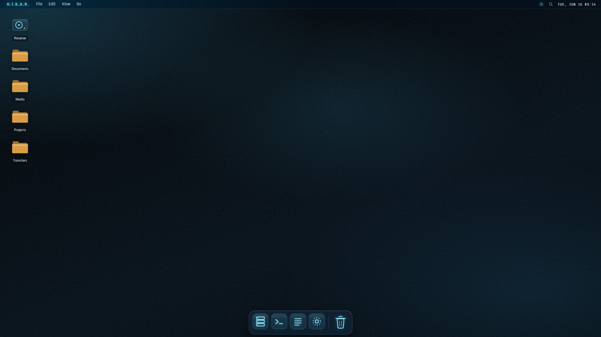

<div align="center">

# H.İ.S.A.R. Mark I

**H**ızlı **İ**letişim **S**aklama ve **A**ktarım **R**ezervi — *Rapid Communication Storage & Transfer Reserve*

A self-hosted, web-based file-transfer system with a full **macOS-style desktop** front end, dressed in the **SPEDA Mark VI** fluid-glass (JARVIS) interface.


</div>

---

## Overview

H.İ.S.A.R. lets a single owner log in and manage files inside a sandboxed directory on a server, through a browser interface that behaves like a desktop operating system — menubar, dock, draggable windows, a Finder, Quick Look, and Spotlight.

This repository currently contains the **front-end client** (React + Vite). It runs against an in-memory demo filesystem out of the box; the file operations are isolated behind a small seam that is designed to be swapped for the planned FastAPI backend (see [Backend integration](#backend-integration)).

> **Note** — this is a personal, single-user system. There is no public sign-up and no multi-tenant logic by design.

## Screenshots

<div align="center">



</div>

Both **dark** (default) and **light** appearances ship; toggle via the **View** menu or the Appearance icon in the dock.

## Features

**Desktop environment**
- Menubar with working dropdown menus, an arc-reactor system indicator, Spotlight glyph, and a live monospace clock.
- A magnifying **dock** with running-app indicators, launch bounce, and tooltips.
- **Snap-to-grid desktop icons** (Windows-style) that stay draggable and reflow without overlapping.
- macOS-style **lock-screen login**.

**Windowing**
- Multiple **Finder** windows with focus / z-order, dragging, 8-way resize, **zoom/maximize**, and **minimize-to-dock** (restore from a dock chip).
- A lightweight **TextEdit** viewer for text files.

**File management** *(in-memory demo — see Backend integration)*
- Grid and list views, breadcrumb navigation, sidebar favorites.
- Multi-select via ⌘/Ctrl-click, ⇧-click ranges, **rubber-band drag**, and ⌘A.
- New folder, rename, delete, and **drag-and-drop upload**.
- **Quick Look** (Space) and **Spotlight** fuzzy search (⌘Space).

**Design**
- The **SPEDA Mark VI** fluid-glass FUI: petrol-void background with drifting ambient pools, cyan primary accent, amber for folders / selection / timestamps, liquid-glass surfaces, and Rajdhani + Share Tech Mono typography.
- No movie-prop clutter — no grids, brackets, ticks, or scanlines.

## Keyboard shortcuts

| Shortcut | Action |
| --- | --- |
| `⌘ / Ctrl + Space` | Open Spotlight |
| `⌘ / Ctrl + N` | New Finder window |
| `Space` | Quick Look the selection |
| `Enter` | Open the selection |
| `⌘ / Ctrl + A` | Select all |
| `Delete` / `Backspace` | Move selection to Trash |
| `← → ↑ ↓` | Move selection |
| `Esc` | Close menu / Quick Look / Spotlight |

## Tech stack

- **React 18** (function components + hooks, no external state or UI libraries)
- **Vite 5** for dev server and bundling
- A single self-contained component (`hisar.jsx`) with an injected stylesheet — no CSS framework
- Hand-built SVG icon set; web fonts: Rajdhani, Share Tech Mono

## Getting started

### Prerequisites

- **Node.js 18+** and npm

### Install & run

```bash
git clone https://github.com/spedatox/hisar-mk1.git
cd hisar-mk1
npm install
npm run dev
```

Open the URL Vite prints (default `http://localhost:5173`). Log in with any password — the login is a demo until the backend is wired.

### Build

```bash
npm run build     # production build → dist/
npm run preview   # serve the production build locally
```

## Project structure

```
hisar-mk1/
├── index.html        # Vite entry
├── main.jsx          # React mount (StrictMode)
├── hisar.jsx         # The entire desktop client (component + styles)
├── vite.config.js
└── package.json
```

## Backend integration

The front end talks to its filesystem through a single seam — the `doMkdir`, `doRename`, `doDelete`, `doUpload` handlers and the directory listing derived from `fs` state inside `hisar.jsx`. Replacing those with `fetch` calls connects the UI to a real server.

The planned backend is a **FastAPI** service exposing a sandboxed REST API:

| Method | Endpoint | Purpose |
| --- | --- | --- |
| `POST` | `/auth/login` | Username + password → JWT |
| `GET` | `/files/list?path=` | Directory listing |
| `POST` | `/files/upload?path=` | Multipart upload |
| `GET` | `/files/download?path=` | Stream a file |
| `DELETE` | `/files/delete?path=` | Delete a file / empty folder |
| `POST` | `/files/mkdir` | Create a directory |
| `POST` | `/files/rename` | Rename / move within the sandbox |

Every path is validated against a single configurable `SANDBOX_ROOT` to prevent traversal or symlink escapes. A base URL would be supplied to the client via a `VITE_API_BASE` environment variable.

## Roadmap

- [ ] Wire file operations to the FastAPI backend (JWT auth, real listings)
- [ ] Real upload/download with progress
- [ ] Persist desktop icon layout and window positions
- [ ] Restore-from-Trash and an Empty Trash action
- [ ] Mobile / touch layout

## License

© 2026 spedatox. All rights reserved. This is a private project; no license for reuse or redistribution is granted at this time. Add a `LICENSE` file (e.g. MIT) if you decide to open-source it.

---

<div align="center">
<sub>Built with the SPEDA Mark VI design language.</sub>
</div>
